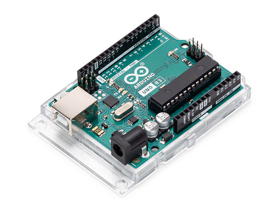
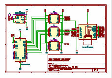
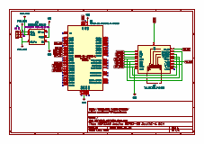

# MSP "Red Display" SPI Sharing
Coding examples to demonstrate sharing of SPI pins on the MSP Red Display for both Arduino Uno R3 and ESP32-S3 MCU.

The 240x320 TFT displays with an ILI9341 controller and XPT2046 touch controller with their distinctive red circuit board are very common.
Models:
-   2.4" SKU:  [MSP2402](http://www.lcdwiki.com/2.4inch_SPI_Module_ILI9341_SKU:MSP2402) (lcdwiki)
-   2.8" SKU:  [MSP2807](http://www.lcdwiki.com/2.8inch_SPI_Module_ILI9341_SKU:MSP2807) (lcdwiki)
-   3.2" SKU:  [MSP3218](http://www.lcdwiki.com/3.2inch_SPI_Module_ILI9341_SKU:MSP3218) (lcdwiki)

## Introduction
The [newbie](https://en.wikipedia.org/wiki/Newbie) may, at first, struggle to get these devices up and running.  Search Engines, Discussion Forums, and AI-assistants can sometimes offer conflicting information, making the clarity of setup a small mystery.

[Toubleshoot Tips](#troubleshooting-tips)

Presented here are GPIO pinout and connection suggestions and tips for those bringing this display into their project.  We include some datasheets, and source code to demonstrate the three systems found in the MSP display:
- TFT 240x320 Display and SPI ILI9341 Driver
- Resistive Touch Screen and SPI XPT2046 Controller
- SD Card SPI Connector

We offer two potential MCU configurations:
- Arduino Uno R3 A000066
	 
- ESP32-S3-DevKitC-1
	
 

The [LCDWiki](http://lcdwiki.com/) site is an excellent resource for data and information on these and other display products, such as those made sold by [Adafruit](https://www.adafruit.com/), [AliExpress](https://www.aliexpress.us/), [Amazon](https://www.amazon.com/), [DigiKey](https://www.digikey.com/) and [Waveshare](https://www.waveshare.com/).

## MSP Module Pin Description
| Number | Module Pin | Description |
| :------: | :--------: | :----------- |
| J2-1  | VCC     | LCD power supply is positive (3.3V~5V) |
| J2-2  | GND     | LCD Power ground |
| J2-3  | CS      | LCD selection control signal |
| J2-4  | RESET   | LCD reset control signal |
| J2-5  | DC/RS   | LCD register / data selection control signal |
| J2-6  | SDI(MOSI) | LCD SPI bus write data signal |
| J2-7  | SCK     | LCD SPI bus clock signal |
| J2-8  | LED     | LCD backlight control signal (high level lighting, if you do not need control, please connect 3.3V) |
| J2-9  | SDO(MISO) | LCD SPI bus read data signal |
| J2-10 | T_CLK   | Touch screen SPI bus clock pin |
| J2-11 | T_CS    | Touch screen chip select control pin |
| J2-12 | T_DIN   | Touch screen SPI bus write data pin |
| J2-13 | T_DO    | Touch screen SPI bus read data pin |
| J2-14 | T_IRQ   | Touch screen interrupt detection pin |
| J4-1  | SD_CS   | SD card chip select control pin |
| J4-2  | SD_MOSI | SD card SPI bus write data pin |
| J4-3  | SD_MISO | SD card SPI bus read data pin |
| J4-4  | SD_SCK  | SD card SPI bus clock signal |

## SPI Interface
The SPI ([Serial Peripheral Interface](https://en.wikipedia.org/wiki/Serial_Peripheral_Interface)) interface is one of two common interfaces used by the Arduino Platform to communicate with other chips, breakouts and devices.  Observe in the diagram the single-slave model.

The SPI transfers data between the Master (typically the MCU, such as the Arduino) and the Slave (the chip or device).  The transfer speeds can be quite high, upwards to 80 MHz or more.  Of course, the Arduino Uno R3 is pretty slow, in terms of MCU processors, and is limited to 4 MHz SPI speed.

Data is transferred serially one-bit at a time and in one direction on one of two signals:
* `MOSI` (MOH-zee) from Master to Slave, that is Master Out - Slave In.
* `MISO` (MEE-soh) from Slave to Master, that is Master In - Slave Out.

Because the transfer speeds can be quite high, a separate serial clock signal is used to allow either side to read and write at those speeds.  The clock is often referred to as `SCLK` or just `CLK`.

A fourth signal, Slave Select `SS` is used to select the slave and signal it to use the `MOSI` and `MISO` signals for communication.  While the `SS` is inactive, the slave is free to ignore or disregard any activity on the `MOSI` and `MISO` lines.  The select may also be referred to as a Chip Select `CS` and is synonymous with `SS`

The three functions found on the "Red Display" with touch feature (two functions without) are each SPI devices and may share (multi-drop configuration) the same SPI wires to conserve GPIO pins when they are limited.

In the multi-drop model, the devices share `SCLK`, `MOSI`, and `MISO` but each slave has a dedicated select `SS` signal.

For some, its simpler to place each slave their own sets of GPIO pins.  Opinions may vary which is best.  When the number of SPI slaves is small, and GPIO pins abundant, it may be toss which is best.

The LCDWiki guides, for example, suggest using separate GPIO pins on the Arduino Uno R3.  This works for many, and the single-slave model is indeed simpler, but we will be continuing our discussion in this repository using the multi-drop configuration.

## Power and Voltage Levels
The MSP "Red Display" may be powered on `VCC` with any convenient voltage between 3V3 (3.3V) and 5V0 (5.0V) DC.  The schematics show us that `U1` uses an `XC6206` voltage regulator to regulate the voltage to 3V3, internally.  Note, however, when powering the display with 3V3, it is best to bypass the regulator at `U1` by closing the solder jumper at `J1`

The `LED` pin may be powered by a PWM signal, when desired, to attenuate the LED backlighting.  Or for simply full brightness, one may connect the pin to any convenient 3V3 power source, but do note 3V3 is the maximum, so avoid powering with 5V0.

The majority of signals on the MSP are designed for 3V3 levels.  Many of the ESP32 MCUs run using 3V3 GPIO signal levels, so this is convenient.  But be aware, the Arduino Uno R3, and several other MCU models, are running with 5V0 signal levels.  To connect the Uno to the Red Display, one must use *Level Shifters*.

## GPIO Pin Connection Arduino Uno R3
| Number | Module Pin | MCU Wiring Pin |
| :------: | :--------: | :-----------: |
| J2-1  | VCC      | 3.3 |
| J2-2  | GND      | GND |
| J2-3  | TFT_CS   | 10  |
| J2-4  | TFT_RST  | 7   |
| J2-5  | TFT_DC   | 8   |
| J2-6  | TFT_MOSI | 11  |
| J2-7  | TFT_CLK  | 13  |
| J2-8  | TFT_LED  | 9   |
| J2-9  | TFT_MISO | 12  |
| J2-10 | TS_CLK   | 13  |
| J2-11 | TS_CS    | 6   |
| J2-12 | TS_MOSI  | 11  |
| J2-13 | TS_MISO  | 12  |
| J2-14 | TS_IRQ   | NC  |
| J4-1  | SD_CS    | 5   |
| J4-2  | SD_MOSI  | 11  |
| J4-3  | SD_MISO  | 12  |
| J4-4  | SD_SCK   | 13  |

* [MSP3218-UnoR3-Wiring-Schematic

](docs/MSP3218-UnoR3-SCH.pdf)
* Demonstration Example ([Arduino IDE](Arduino/)) ([PlatformIO](PlatformIO/)) 

## GPIO Pin Connection ESP32-S3
| Number | Module Pin | MCU Wiring Pin |
| :------: | :--------: | :----------- |
| J2-1  | VCC      | 3.3 |
| J2-2  | GND      | GND |
| J2-3  | TFT_CS   | 10  |
| J2-4  | TFT_RST  | 6   |
| J2-5  | TFT_DC   | 7   |
| J2-6  | TFT_MOSI | 11  |
| J2-7  | TFT_CLK  | 12  |
| J2-8  | TFT_LED  | 5   |
| J2-9  | TFT_MISO | 13  |
| J2-10 | TS_CLK   | 12  |
| J2-11 | TS_CS    | 4   |
| J2-12 | TS_MOSI  | 11  |
| J2-13 | TS_MISO  | 13  |
| J2-14 | TS_IRQ   | NC  |
| J4-1  | SD_CS    | 2   |
| J4-2  | SD_MOSI  | 11  |
| J4-3  | SD_MISO  | 13  |
| J4-4  | SD_SCK   | 12  |

* [MSP3218-ESP32S3-Wiring-Schematic
](docs/MSP3218-ESP32S3-SCH.pdf)
* Demonstration Example ([Arduino IDE](Arduino/)) ([PlatformIO](PlatformIO/)) 

## Troubleshooting Tips
* The entire display, and all three of its functions (display, touch and sd-card) are powered by the same pins, `VCC` and `GND`.  Measure voltages with a meter, when needed.
* The SPI pins within the MSP3218 are NOT connected together.  The SPI pins at the connector MUST be connected to the MCU to function properly.

* **Black Screen**
	* Cause: LED Pin Not Powered. The TFT LED display without LED backlight power will aways appear black, even when the display is correctly wired, configured, working, and content has printed to the display.
		* Look closely as the powered display (in a dark room, if needed) to confirm the LED is lit.  Even a screen with a black background with no content will show evidence the LED backlight is indeed lit.
		* Examine your LED signal pin, if you cannot see the LED is on.  Measure the voltage, if needed.
		* Make sure the VCC and GND connections are functioning.
*  **White Screen**, **Garbled Screen**
	* Cause: ILI9341 not getting initialized. The ILI9341 is a write-only device (more or less) and there are about 20 commands sent to initialize the device for use after a reset.  There are several possible ways the ILI9341 might not be fully initialized.  Some of them are:
		* Wrong SPI wiring on `SCK`, `MOSI`, `MISO` pins.  Inspect and confirm.
		* Bad `CS` Chip Select pin  Inspect and confirm.
		* Missing `RST` pin.  Many ILI9341 libraries treat the `TFT_RST` pin as optional, allowing them to be set to `-1`.  Tests show in most cases, the MSP Modules need a definite hardware reset.  Be sure this pin is connected to the MCU and configured in the display driver.
		* Other SPI devices are selected blocking data lines.  It is customary to setup the display first in the `setup()` method.  We often do this, so we may display error messages to the display later in `setup()`.  When the MCU first powers up, the state of the GPIO pins used as SPI Slave Selects may be indetermined, potentially floating HIGH or LOW.  SPI `SS` pins are active LOW, so it may be possible in their LOW state, one or more SPI devices are active while the ILI9341 is being initialized.  When an SPI device is selected, it may affect the `MISO` and `MOSI` pins.  To resolve, initially set all the SPI `SS`  GPIO pins to OUTPUT mode and in a HIGH state, as early as possible in `setup()`.
	* The SPI speed is too fast for display or wiring.  Test as slower speeds to confirm.  Once the display appears to work, you can speed things back up and retest.
		* Solo speed tests good at 40 MHz, but not when shared, or wired by bread board jumper wires.
		* Shared at 35 MHz tests good with bread board.
		* Arduino Uno R3 runs up to 4 MHz SPI speed.
		* ESP32-S3 runs up to 80 MHz SPI speed.
## Resources
- 2.4-inch MSP2402 SPI Module [user manual](/docs/2.4inch_SPI_Module_MSP2402_User_Manual_EN.pdf), [schematic](/docs/MSP2402-2.4-SPI-SCH.pdf)
- 2.8-inch SPI Module [user manual](/docs/2.8inch_SPI_Module_MSP2807_User_Manual_EN.pdf), [schematic](/docs/MSP2807-2.8-SPI-SCH.pdf)
- 3.2-inch SPI Module [user manual](/docs/3.2inch_SPI_Module_MSP3218_User_Manual_EN.pdf), [schematic](/docs/MSP3218-3.2-SPI-SCH.pdf)
- MCU Arduino Uno R3 A000066 [datasheet](docs/Arduino-A000066-datasheet.pdf) ([arduino.cc](https://docs.arduino.cc/hardware/uno-rev3/))
- MCU ESP32-S3 DevKitC-1 [datasheet](/docs/ESP32-S3-datasheet.pdf) ([espressif](https://docs.espressif.com/projects/esp-dev-kits/en/latest/esp32s3/esp32-s3-devkitc-1/index.html))
 - BSS138 Bi-Directional Logic Level Converters [datasheet](/docs/BSS138.pdf) ([Adafruit](https://www.adafruit.com/product/757))
- ILI9341 Single Chip Driver [datasheet](/docs/ILI9341.pdf)
- SD Card [datasheet](/docs/SD.pdf)
- XC6202 Voltage Regulator [datasheet](/docs/XC6206.pdf)
- XPT2046 Touch Screen Controller [datasheet](/docs/XPT2046.pdf)
